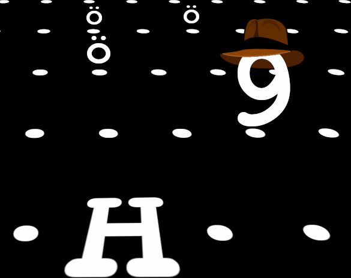

# Treasure Hunter Z II: The Escape

560 character "roguelike" for #TweetTweetJam!

After having looted the buried gold of a forgotten civilization, you presumed that the getaway would be equally as safe as your entrance. The resident souls, however, have taken offense to your pilfering and have risen up to strike you down! With their hungering claws grasping at your heels, you must reach the helicopter before you fall to the inevitable hordes of the undead!

## Controls
Arrow keys or some other combination of arbitrary keys due to how keys are detected.

## Gameplay
  * Find the helicopter to escape.
  * Flee from or kill the undead with two strikes.
    * Use the trees and ruins to hide! 
  * Don't die!

## Tiles
|Tile|Character(s)
|-|-
|Dr. Z              | 1 through 9
|escape helicopter	| H
|hungering undead   | ö
|corpse             | ,
|tree               | *
|ruins              | #
|ocean              | ~

  
## Screenshot

